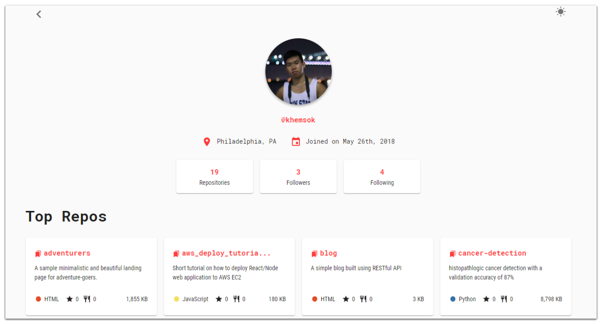

  <h1>LookUpYourGithub 👀</h1>
  
  A Fancy GitHub Profile Viewer ✨

### Features 🎨

- **🔎 Search User**: Search a GitHub user
- **🔢 User Information**: Display user information (e.g. date joined)
- **📃 Repos/Followers/Following**: Different pages to show user stats
- **📚 Top Repositories**: Show user's top repositories
- **🌓 Light/Dark Mode**: Display different color modes

### Technologies 🔨

- **🌐 React JS**: Front End
- **⚡React Router**: Page Routing
- **🐱 [GitHub API](https://developer.github.com/v3/)**: API to fetch the data

### Developed by [Khem Sok](https://github.com/khemsok) 🧐

Thanks For Reading!
